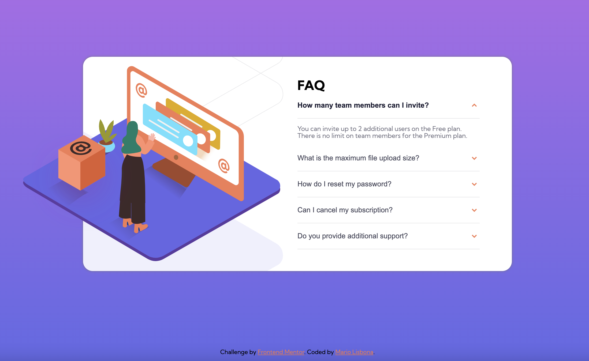
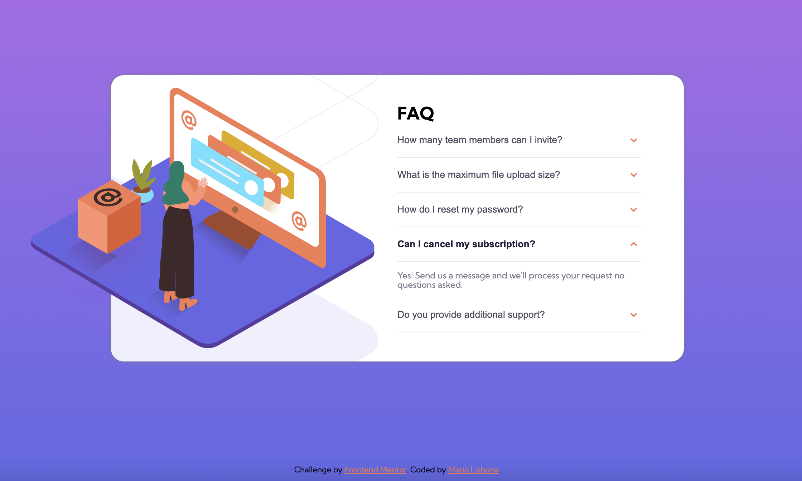

# Frontend Mentor - FAQ accordion card solution

This is a solution to the [FAQ accordion card challenge on Frontend Mentor](https://www.frontendmentor.io/challenges/faq-accordion-card-XlyjD0Oam). Frontend Mentor challenges help you improve your coding skills by building realistic projects. 

## Table of contents

- [Overview](#overview)
  - [The challenge](#the-challenge)
  - [Screenshot](#screenshot)
  - [Links](#links)
- [My process](#my-process)
  - [Built with](#built-with)
  - [What I learned](#what-i-learned)
  - [Continued development](#continued-development)
  - [Useful resources](#useful-resources)
- [Author](#author)
- [Acknowledgments](#acknowledgments)

**Note: Delete this note and update the table of contents based on what sections you keep.**

## Overview

### The challenge

Users should be able to:

- View the optimal layout for the component depending on their device's screen size
- See hover states for all interactive elements on the page
- Hide/Show the answer to a question when the question is clicked

### Screenshot

### Links

- Solution URL: [Add solution URL here](https://github.com/MarioLisbona/FEM-FAQ-accordion-card)
- Live Site URL: [Add live site URL here](https://mariolisbona.github.io/FEM-FAQ-accordion-card/)

## My process

### Built with

- Semantic HTML5 markup
- CSS custom properties
- Flexbox

### What I learned

I learned how to create the logic and containers for the accordion elements. I checked out a few pages on w3Schools and stackoverlfow to learn how to write the html/css and javascript.
I also learned how to postion background images and used position relative/absolute and z-index to position the cube image.
I couldnt figure out how to have the left portion on the woman online image to be behind the background.

I also found some javascript that i modified to allow only 1 accordion at a time to be open. There is a hiccup with the javascript where i use toggle.('active') to toggle the active class on and off. I coudlnt figure out how to remove the .active class once the panel collapes. This means that the panel will collapse but it still has the active class which  is why the arrow is pointed the wrong way and the font weight is 700. i tried classList.remove() but i couldnt find a solution.

### Continued development

I will continue to research how to allow only 1 accordion to be open at a time while being able to add/remove the .active class to allow the proper font weight and arrow direction to be shown.

### Useful resources

- [Accordion Code](https://www.w3schools.com/howto/howto_js_accordion.asp) - This helped me learn the code to implement various types of accordion structures and the javacsript to change the height of the panel to shrink/show the answer text.
- [javascript - Single panel open at a time](https://stackoverflow.com/questions/69145525/accordion-that-allows-only-one-open-at-a-time) - I adjusted this to make only one panel open at a time. I tried modifiying it to allow the .active class to be added/removed for proper font weight and arrow direction but couldnt get it working.

## Author

- Frontend Mentor - [@MarioLisbona](https://www.frontendmentor.io/profile/MarioLisbona)
